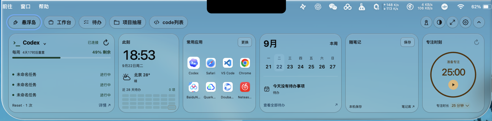
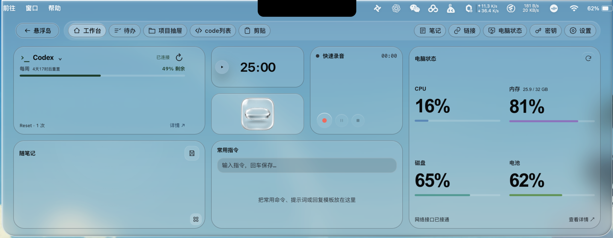
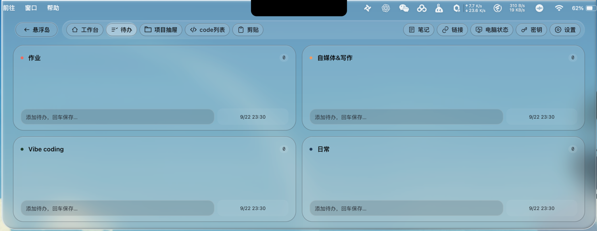
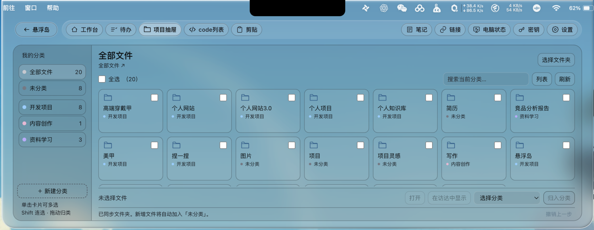
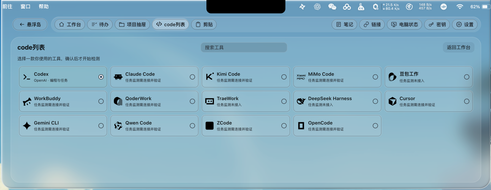
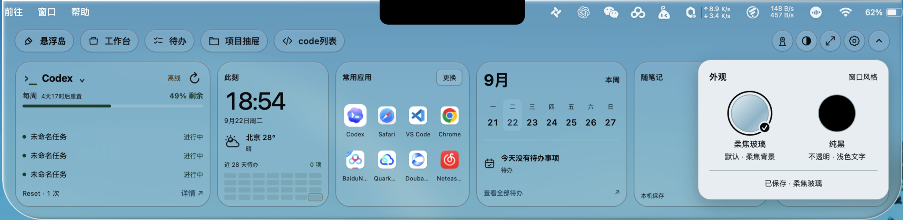
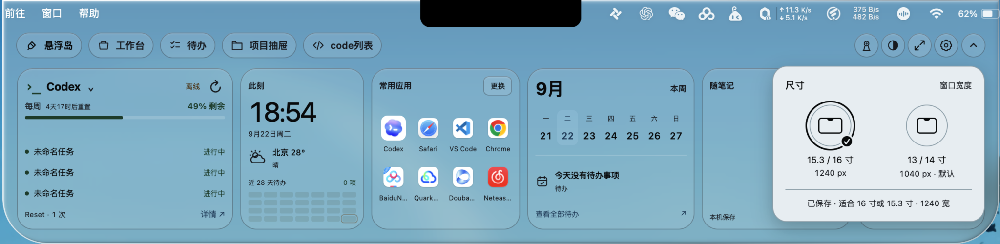
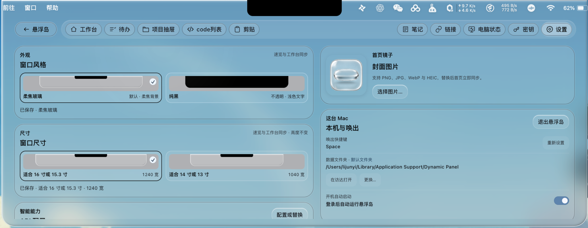

<div align="center">
  
  <h1>悬浮岛 · XuanfuDao</h1>
  <p><strong>把工作台，藏进 Mac 顶部。</strong></p>
  <p>AI 任务、待办、笔记、项目和专注计时，一个抬眼就能找到的本地工作台。</p>
  <p>
    <a href="#功能一览">功能一览</a> ·
    <a href="#从源码运行">开始使用</a> ·
    <a href="https://github.com/17lijunyi/xuanfudao/releases">版本与下载</a> ·
    <a href="https://github.com/17lijunyi/xuanfudao/issues">反馈问题</a>
  </p>
  <p>
    
    
    
    <a href="LICENSE"></a>
  </p>
</div>

悬浮岛是一个常驻 macOS 屏幕顶部的本地效率工具。平时收在刘海附近，需要时展开，把查看 AI 任务、记下一句话、打开项目和安排今天的事情放在一起。

本项目由 [17lijunyi](https://github.com/17lijunyi) 基于 [TO-DO Panel](https://github.com/xiaopu-ai/TO-DO-Panel) 持续开发，保留上游 MIT 许可与署名。

> 当前源码版本：**1.5.1**。本仓库尚未发布悬浮岛安装包，可先从源码运行；后续安装包统一放在本仓库的 [Releases](https://github.com/17lijunyi/xuanfudao/releases)。顶部是 IP 品牌插画，下方均为作者提供的真实界面截图；玻璃颜色会随背后的桌面变化，截图中的蓝色并非固定主题色。

## 功能一览

### 01 · 速览：常用信息，一眼看完



展开横向速览，就能看到 AI 工具额度与任务、时间天气、八个常用应用、本周待办、随笔记和番茄钟。常用应用可以自行更换；随笔记在本机保存，再存入笔记库继续整理。

从速览进入工作台，卡片会移动到新的位置；返回后移开鼠标自动收起。点击输入框或主动保持打开时，面板会留下来供你编辑。

### 02 · 工作台：把正在做的事放在一起



用一块卡片式工作台连接日常工作：看 AI 任务，开一轮专注计时，录下想法，记笔记，保存常用命令、提示词或回复模板。右侧集中查看 CPU、内存、磁盘和电池状态。

镜子只有主动点击才开启，离开首页或收起就释放摄像头；录音也由你主动开始。首页组件支持隐藏、恢复和布局调整。

### 03 · 待办：四个分类，安排不同的生活



四个分类各占一块区域，可以按学习、写作、Vibe coding、日常等习惯命名。输入内容后按回车新增，支持截止时间、排序和到期前一小时提醒。分类名可随时调整，完成一项就勾掉一项。

### 04 · 项目抽屉：文件归类，打开就用



选择一个本地文件夹，把项目、资料和内容放进自己的分类。支持搜索、卡片／列表视图、多选、Shift 连选、拖拽归类，以及双击打开或在访达中定位。

归类只记录应用内的分组，**不会移动或删除原文件**。来源目录中新增的文件会自动出现在「未分类」。

### 05 · code 列表：选择你真正使用的 AI 工具



先选择并确认一款工具，再开始检测；浏览和搜索不会自动连接。确认后，速览、工作台和折叠岛同步显示所选工具。

| 状态 | 当前范围 |
| --- | --- |
| Codex | 本机只读额度；任务状态与完成提醒需配置官方 Hook / notify |
| 提供任务接入 | Claude Code、Kimi Code、Gemini CLI、Qwen Code、WorkBuddy、QoderWork、Cursor、ZCode、OpenCode、MiMo Code；需客户端版本支持并完成连接验证 |
| 尚未接入可靠自动监测 | 豆包工作、TraeWork、DeepSeek Harness |

工具出现在列表中，不代表已完成连接或已有额度来源。缺失额度显示 `—`；各客户端的条件与验证范围见 [AI 工具连接说明](docs/code-tools.md)。

### 06 · 外观与尺寸：适合你的桌面



在「柔焦玻璃」与「纯黑」之间切换。前者让桌面自然透过面板，后者使用不透明黑底与浅色文字；速览、工作台和顶部提醒同步切换，并在重启后保留。



提供 **1040px** 与 **1240px** 两档宽度，分别适合 13 / 14 寸与 15.3 / 16 寸屏幕。速览与工作台保持贴顶居中，切换宽度不改变工作台高度。

<details>
<summary>展开查看完整设置页</summary>



设置页还可以管理镜子封面、唤出快捷键、首页组件、功能显示、数据目录和开机启动。截图中的路径是作者本机示例，应用会使用当前用户自己的数据目录。

</details>

### 还有这些随手可用的能力

| 能力 | 可以做什么 |
| --- | --- |
| 笔记库 | 从速记保存，继续编辑、搜索和重命名 |
| 链接收藏 | 保存公开网址，补全标题与图标，按组整理 |
| 剪贴板历史 | 按需启用，本机采集文字与图片；默认关闭 |
| 录音与转写 | 音频本地保存，可选配置百炼 Qwen3-ASR 实时转写 |
| 密钥管理 | 账号、密码和 API Key 通过 macOS 安全存储加密 |
| 双段胶囊提醒 | AI 完成、待办截止、番茄钟、电源和音频设备状态共用顶部提醒 |

## 从源码运行

建议使用 **macOS 13.0+、Apple Silicon、Node.js 22.12.0+**，并安装 Xcode Command Line Tools，用于编译原生玻璃和系统状态模块。

```bash
git clone https://github.com/17lijunyi/xuanfudao.git
cd xuanfudao
npm ci
npm start
```

首次进入「code列表」可选择并确认使用的工具，也可以返回工作台先使用其他功能。摄像头、麦克风及其他系统权限按所用功能申请；AI 任务监测的接入步骤见 [连接说明](docs/code-tools.md)。

项目采用 Electron + 原生 HTML / CSS / JavaScript，桌面渲染层无需额外构建。`npm start` 会先编译所需原生模块，再启动应用。

| 命令 | 用途 |
| --- | --- |
| `npm start` | 启动桌面开发版 |
| `npm test` | Node 单元测试、Electron 交互检查与语法检查 |
| `npm run build` | 自行构建 Apple Silicon DMG；不代表已完成 Apple 公证 |
| `npm run build:distribution` | 配置 Developer ID 与公证凭据后，生成对外分发包 |

官网源码在 `website/`，使用 React 19 + Vinext，要求 Node.js 22.13.0+，见 [官网开发说明](website/README.md)。

## 本地数据与权限

待办、笔记、链接、录音与设置主要保存在当前 Mac，没有项目自建后端或云同步。天气、网页标题抓取，以及你主动配置的 AI / 转写服务会按功能访问对应服务；这不等于所有功能都能离线使用。

剪贴板默认关闭；摄像头与麦克风按需开启。项目抽屉只管理分组元数据，个人任务、工具事件、账号凭据与运行缓存不随源码分发。

## 开发与贡献

欢迎通过 [Issues](https://github.com/17lijunyi/xuanfudao/issues) 反馈问题，附上 macOS 版本、屏幕尺寸、所选主题和复现步骤。提交代码前请运行相关检查；应用行为与当前边界以本 README 为准。

```text
.
├── main.js / main-services.js   # 主进程、窗口与领域服务
├── preload.js                  # IPC 安全桥接
├── renderer/                   # 桌面界面与卡片动效
├── native/                     # macOS 原生玻璃与系统状态
├── scripts/                    # 编译、通知与任务 Hook
├── tests/                      # 单元与 Electron 回归测试
├── docs/                       # 产品截图与技术说明
└── website/                    # 产品官网源码
```

完整改动见 [CHANGELOG](CHANGELOG.md)；安装包签名、权限与发布步骤见 [发布说明](docs/releasing.md)。目前为源码公开阶段，尚无本项目已发布的稳定安装包。正式发版时会同步版本号、标签、校验文件与下载入口。

## 完整行为说明

<details>
<summary>展开查看交互、尺寸、数据结构和原生实现边界</summary>

悬浮岛是一个常驻 macOS 屏幕顶部的本地工作台。默认收在物理刘海及其左右侧翼，点击后从顶部展开；常用信息和动作不必再散落在多个应用里。

系统界面避让：折叠岛始终保持 256px 宽，不裁边、不缩翼，也不因常驻菜单栏图标隐藏两侧状态。临时系统浮层或已打开的菜单侵入岛体时暂时隐藏折叠层，系统界面离开后恢复完整岛体。悬停预览按完整区域检查冲突。通知被遮挡时暂停可见停留计时，恢复后继续；锁屏、休眠期间不展示这些浮层。普通菜单栏背景与常驻状态项不触发临时避让。检测仅读取窗口位置，不采集窗口标题或屏幕内容。

| 页面 | 解决什么问题 |
| --- | --- |
| **工作台** | 电脑状态、镜子、快速录音、随笔记、常用指令、Codex 额度与任务和番茄钟集中在一个 Bento 工作台 |
| **待办** | 四个可改名的工作流，截止日期可逐月切换并自然跨年，按截止时间排序，并在到期前一小时提醒 |
| **项目抽屉** | 浏览「桌面 / 全部文件」，自定义分类、拖拽或批量归类，自动发现新增文件 |
| **code列表** | 在工作台内选择并确认使用的 code 工具，统一速览和工作台的工具状态 |
| **随笔记** | Markdown 速记、归档、搜索、重命名与智能标题 |
| **链接** | 保存公开网址，后台补全标题、图标和分组 |
| **电脑状态** | CPU、已用内存与总量、内存压力、系统磁盘、电池、网速、运行时长；内存缓存与压缩量在详情中单列，右上「录音资料」仍可打开原录音与转写 |
| **密钥** | 使用 macOS 安全存储加密账号、密码和 API Key |
| **设置** | 当菜单栏图标被刘海遮挡时，仍可在面板内选择柔焦玻璃或纯黑外观，并配置 API、镜子、首页组件、功能显示、快捷键、数据目录与开机启动 |

悬浮岛速览的「常用应用」可自定义 8 个位置：点右上角「更换」，再点要替换的图标，从 Mac 原生选择窗口中选择应用，名称和图标自动更新；点「完成」或按 Escape 结束更换。选择自动保存到 `userData/quick-launch.json`，重启仍保留。取消选择或保存失败会保留原应用，重复应用会提示重新选择；未安装的位置可以添加应用，已经移除的应用保留位置供重新选择。应用选择窗口打开期间，悬浮岛保持展开。

随笔记可直接用鼠标点击输入，无需先按空格激活。悬停速览仍不抢键盘焦点；点击输入框后才激活应用，并保留点击位置的光标。速览和工作台输入时使用浮动窗口层级（macOS 原生层级 3），低于中文候选框的层级 20，允许候选框完整显示在面板前方。折叠与被动悬停保留原来的置顶行为。速览与工作台画布始终贴顶，导航位于菜单栏安全区下方，防止 AppKit 自动挪动窗口或菜单栏挡住导航；工作台采用 B 档整窗尺寸 1040 × 480px（含菜单栏安全区与导航）；内容高度为 480 减去当前菜单栏高度与 76px 导航留白，窄屏与矮屏仍保留 24px 安全距。

悬浮岛首次打开会先进入工作台的「code列表」页。速览和工作台的导航入口均紧接「项目抽屉」，点击后进入工作台内的独立选择页；卡片上的工具名称也跳转到同一页。这里是单选：点击候选项后，先确认「你是否使用这款工具？」，确认保存成功才检测并连接这一款。浏览、搜索、返回和取消都不会扫描工具，也不默认连接 Codex。点击「返回工作台」可直接使用其他功能；确认页按 Escape 仅取消候选项。选择以版本 2 保存到 `userData/ai-tools.json`；重启只恢复已确认的这一款。旧版多选设置需要重新确认，保存失败保留原选择。

macOS 应用菜单、完整面板的窗口标题和首页导航统一显示「工作台」。应用图标、首页镜子的默认配图与设置中的预览统一使用无色透明玻璃图标，保留圆角厚边、悬浮胶囊和高光，PNG 含真实透明通道，保持完整比例；已主动设置的自定义照片继续沿用。只有点击镜子才开启摄像头。

「设置 → 外观 → 窗口风格」提供「柔焦玻璃」与「纯黑」，柔焦玻璃作为默认外观，选中的选项在选择区首位显示。首次启动、旧透明玻璃及旧五档玻璃偏好统一使用柔焦玻璃；主动选择纯黑后，重启继续保留。纯黑使用不透明黑色外框与浅色文字，关闭原生玻璃和背景模糊；柔焦玻璃保留通透底色和边缘高光，通过独立模糊柔化后方窗口，配近黑色文字和清晰的状态色。透明玻璃与弱模糊不再作为可选或回退效果。选择后速览与工作台同步生效。柔焦玻璃下，顶部每个入口都有独立胶囊边框，速览的任务、时钟、常用应用、日历、随笔记、番茄钟分别置于圆角玻璃卡片，工作台各功能也以独立边框区分。速览与工作台外框采用左上高光、右下暗边和内侧柔光的立体玻璃边缘，随面板一起收放。入口名称统一为「悬浮岛」。展开速览时，折叠岛暂时隐藏绘制与鼠标命中，任务更新不会把角标盖在速览上；速览收回后恢复纯黑折叠岛及白色额度、天数、图标和计数。随笔记的保存按钮与常用应用「更换」共用 36×24px 最小尺寸、7px 圆角、9px 字号和玻璃边框，使用统一的中性玻璃底色与近黑文字，番茄钟只保留一层玻璃卡片边缘，不再叠加橙色边框。偏好单独保存到 `userData/appearance-settings.json`，不改变笔记、任务或本地工作区数据。

速览与工作台之间切换时保留原页面，目标窗口完成布局、内容和玻璃背景绘制后再交接显示，避免先收起再展开造成空白玻璃或桌面闪现。05 号「卡片重排」动效覆盖工作台全部页面，以及速览直接进入各功能页和返回速览：卡片从原位置移动并调整到目标尺寸，其余卡片错峰进入，总时长 460ms。速览与工作台首页仍按任务、随笔记、番茄钟对应，其他页面按可见卡片的位置交接；跨窗口只传递有数量上限的几何信息。文字与控件不缩放，真实节点和草稿保留，隐藏的组件不参与重排。

项目抽屉的分类、搜索和卡片／列表切换，code 工具候选确认与返回、首页组件尺寸与布局、待办排序、剪贴板筛选、链接分组收放及电脑状态／录音资料切换共用相同的重排节奏。外观和尺寸选项、已确认的 code 工具会移至各自选择区的首位；工具仍需确认使用后才保存和检测，取消与搜索不会探测。系统开启「减少动态效果」或没有可用来源卡片时，直接显示已准备好的布局。快速连续切换从当前卡片位置衔接，动效中途收起、隐藏、滚动或调整窗口尺寸会清理临时布局；迟到的跨窗口确认不会抢回焦点。从折叠岛唤出和主动收起仍使用原来的动效。

速览右上角依次提供「镜子 / 外观 / 尺寸 / 设置 / 收起」圆形入口。点击外观或尺寸会在面板内展开圆形单选项：外观默认「柔焦玻璃」，可切换「纯黑」；尺寸默认 1040px（13 / 14 寸），可切换 1240px（15.3 / 16 寸）。选择与工作台设置同步并在重启后保留；点击空白或按 Esc 关闭选项，收起速览时一并关闭。录音、计时活动提示仍保留。

macOS 玻璃背景使用位于 Chromium 后方的轻薄原生 `NSVisualEffectView`，固定为浅色外观和 Active 状态，避免悬停、点击编辑及系统深浅模式改变材质深浅。原生材质恢复原来的 38% 轻薄强度，配合 8% 的中性灰色遮罩，速览与工作台共用参考图中的浅灰白底色；背景柔焦由独立的 20 点模糊完成，Retina 屏不再将模糊半径减半。不能通过增加材质不透明度模拟柔焦，否则会变成灰色实底。悬浮岛自己的文字和输入控件保持清晰。CSS 的 `--glass-desktop-blur` 使用 20px，主进程也将旧版传来的 0、3 或缺失半径统一规范为 20，防止旧透明玻璃重新生效。可选背景滤镜不可用时保留系统原生材质，柔焦强度会受系统能力限制；纯黑会移除整个原生背景。标题、正文和数字使用固定近黑色，辅助说明、输入占位文字与状态色同步加深，悬停时也保持深色，不加阴影、发光或描边。后方窗口变化仍会自然透过玻璃。裁切和透明度跟随现有收放动画，中央 200px 物理刘海安全区保留黑色。收回后整条小岛（包括额度和任务图标的左右侧翼）始终保持纯黑，白色数字、图标和计数不变。背景层不接收鼠标与键盘、不改变窗口尺寸或中文输入窗口层级；独立模糊与材质共用同一圆角遮罩，圆角外和透明留白区域不采样、不残留矩形虚角；收回、隐藏、尺寸变化或移除原生背景时一并释放模糊层，并拒绝隐藏窗口延迟到达的背景更新。

独立桌面模糊动态探测 Core Animation 的非公开 `CABackdropLayer` / `CAFilter` 能力，作为圆角背景的子图层绘制；不再使用会覆盖矩形窗口全域的 `CGSSetWindowBackgroundBlurRadius`，不获取屏幕图像、不要求录屏权限。能力不存在或调用失败时保留原有透明材质；维护排查可用 `FUDAO_DISABLE_NATIVE_BACKGROUND_BLUR=1` 禁用该能力。保持透明度参数不代表所有背景像素完全相同，深色背景的合成色可能略有变化。源码启动会编译原生背景模块，需要 Xcode Command Line Tools 和 Node.js 开发头文件；可用 `FUDAO_NODE_INCLUDE` 指定包含 `node_api.h` 的目录。其他平台或原生模块不可用时保留透明材质，桌面背景模糊不可用。

列表包含 Codex、Claude Code、Kimi Code、MiMo Code、豆包工作、WorkBuddy、QoderWork、TraeWork、DeepSeek Harness、Cursor、Gemini CLI、Qwen Code、ZCode 和 OpenCode。工作台、速览与折叠岛同步当前工具及对应的白色图标。切换后立即停止上一工具的检测，并移除整套旧卡片内容；新工具不会显示 Codex 的任务、额度或历史缓存。未检测到、待连接、等待验证、已收到事件与监测未接入分别展示；选择页直接显示连接结果与连接按钮。

Codex 使用原有只读额度连接；实时任务还需每台电脑配置官方 Hook 与 notify。Claude Code、Kimi Code、Gemini CLI、Qwen Code、WorkBuddy、QoderWork、Cursor、ZCode、OpenCode、MiMo Code 提供各自的本机任务接入：确认选择并检测到安装后，可点击「连接任务监测」，备份并合并对应配置；按客户端提示审核，重启客户端后开启新任务。首次真实事件前显示「等待验证」，只写入配置不会显示连接成功。应用移动后可用「修复连接」更新失效路径，不重复叠加自己的 Hook。豆包工作、TraeWork、DeepSeek Harness 目前仍未接入可靠的自动任务监测，不能作为“全部工具已验证可用”对外发布。所有没有可靠额度来源的工具均显示 `—`。工具列表不安装软件、不读取登录密钥，也不会把模型 token 数伪装成订阅额度。见[连接能力与首次使用说明](docs/code-tools.md)。

设置页「本机与唤出」提供「退出悬浮岛」按钮，可正常退出常驻应用；正在录音或保存录音时会提示先结束并保存。

剪贴板历史默认关闭，可从菜单栏或面板「设置」的「显示功能」中按需启用。菜单栏入口与设置页读写同一份本机配置；即使状态栏图标过多、被物理刘海遮挡，也不影响调整。Codex、Claude Code 与 GPT 的本机完成事件也可以直接显示为不抢焦点的顶部提醒。

「项目抽屉」入口位于悬浮岛速览和工作台的「待办」后面。默认读取当前用户的 `桌面/全部文件` 顶层文件及文件夹，不递归扫描项目内部；可用「选择文件夹」更换来源。左侧包含「全部文件」「未分类」与可新建、重命名、换色、删除的分类，初始提供三个空分类：开发项目、内容创作、资料学习。新文件进入「未分类」，新建、改名、删除通过文件系统监听自动更新，并每 5 秒及打开抽屉、唤醒时核对；同卷原地改名保留分类。

支持搜索当前分类、卡片/列表切换、全选当前结果、拖拽及勾选后批量归类。单击卡片或复选框会累加选择，再点一次只取消该项；Shift 可连续选择区间，「清空选择」或 Escape 取消当前选择。焦点在卡片时，空格键勾选，Command+A 全选当前结果；在搜索框内仍使用文字编辑快捷键。双击或按 Enter 打开项目，也可用「在访达中显示」定位文件。分类是应用内分组，不移动、重命名或删除实际文件；删除分类后项目回到未分类，本次运行可撤销上一步分类操作。分类记录及来源路径单独保存于应用 `userData/project-drawer.json`，视图偏好使用 `notch-project-drawer-view`；跨来源保留各自归类记录。目录不存在或不可读取时显示可恢复的错误，不假装为空目录；损坏的分类记录保留原文件并停止覆盖。

「设置 → 首页组件」可以隐藏或恢复首页的七个组件，但首页至少保留一个。隐藏后，其余组件会自动重新铺满整个 Bento 网格，不留空洞；组件数据、用户保存的排列顺序和尺寸偏好不会被删除或覆盖。只要存在隐藏组件，首页使用自动填充布局并暂时隐藏尺寸按钮；恢复全部七个组件后，原尺寸偏好与按钮会一并恢复。该偏好随当前本地工作区保存，存储键为 `notch-home-hidden-modules-v1`。

首页显隐也遵守资源边界：隐藏镜子会立即释放摄像头；录音进行中不能隐藏仍在首页显示的快速录音卡，但已隐藏该卡也不会禁用「录制」页的录音能力；隐藏 Codex 卡片会停止其展示更新，隐藏电脑状态摘要会停止该卡片的状态采样，番茄钟隐藏后仍继续计时和提醒。

首页「Codex Float」替换原音乐模块，显示本机 Codex 账号的剩余额度、重置倒计时、额外 Reset 和最近任务。任务按「需处理 / 运行中 / 最近完成」分组，等待权限、等待输入、失败与中断优先出现；详情按实际返回列出全部额度窗口和最多八个任务。点击任务进入本机 Codex 对话，Reset 只展示、不消耗。连接失败保留最近成功读数并明确标记离线或陈旧；缺失值显示未知，不伪装为零。无需辅助功能或屏幕录制权限，需本机安装并登录 Codex 客户端。

折叠态采用 07 号角标布局，中央保留原始 **200px** 刘海安全区，左右各 **28px** 侧翼，总宽 **256px**，高度仍与菜单栏一致，下方两角保持 **17px**。左翼白色额度使用系统字体 **400 常规字重**、自然字宽，主读数上限 **11.5px**，`100%` 上限 **9.5px**，内收 **3px** 并在剩余空间居中。额度右上角以 **8px、55% 白色**显示重置天数，仅显示数字、不加 D；依据同一额度窗口的真实重置时间向上取整，不足一天显示 `1`，到期显示 `0`。Codex 额度每 30 秒读取，角标也每分钟核对剩余天数；缺失值显示 `—`，离线读数明确标注。

所有 code 工具共用右翼布局：所选工具的 **16px** 白色品牌图标在运行时显示由下向上的渐层，**2.4 秒连续循环**，右上角 **9px** 显示项目数。相同项目目录的多个任务只计一个项目；目录缺失时按独立会话计数。任务完成后，等对应完成弹窗完全收回才移除该任务的计数，排队的完成提醒仍保留。没有运行项目时显示右上角 **11px** 度数形 `°`，将圆点的视觉中心与左侧天数对齐；工具已连接、暂无已确认运行项目时也显示 `°`，历史任务待同步的真实状态保留在悬浮说明与无障碍信息中；监测未接入、未连接或任务读取失败时显示 `—`。等待权限、等待输入、失败或中断保持静态感叹号。刷新、排序、数量变化不重播运行动画；系统开启减少动态效果时改为静态渐层。两侧角标较原版下移 2px，右翼整体另下移 0.5px，度数形圆点再补偿 1.5px；24px 菜单栏按高度缩小内容，岛体尺寸不变。

**菜单栏图标遮挡（未解决）**：悬浮岛是固定居中的顶层窗口，不参与 macOS 菜单栏排版，其他应用图标仍可能进入左右侧翼后方。2026-09-21 在本机 macOS 26.5.2 验证了「让自己的原生菜单栏项在岛下占位」：AppKit 没有公开的固定居中位置或最高排版优先级接口；实验中的内部优先级参数无效，偏好位置也不能锁定绝对坐标，加宽占位会导致其他项目溢出隐藏。因此未安装这些实验方案，也不再通过裁边或缩翼掩盖问题。原生菜单栏仍由系统分配位置；不能将窗口置顶层级描述为菜单栏排版优先级。实验记录见 [本机菜单栏占位验证](docs/菜单栏占位验证-2026-09-21.md)。

工作台展开后点击空白桌面（包括 macOS「显示桌面」）或切换应用，立即收回到折叠岛，同时保存草稿、释放摄像头并取消未完成的面板动效；主动点击收起仍保留退场动画。

鼠标停在折叠岛上 **400ms** 会展开为 **256 × 56px** 任务预览，显示最高优先级任务、运行时长及状态；移开 **250ms** 自动收回。点击折叠岛、按回车或空格会直接打开完整工作台。工作台的「← 悬浮岛」按钮会保存草稿、释放摄像头并返回 **1240 × 270px** 内容区的横向首页（窗口顶部另加当前菜单栏安全区）；横向首页按 Codex、番茄钟、周历与所选日期待办、随笔记、时钟及天气／近 28 天待办格、八个本机应用快捷入口的 AI 优先顺序排列。天气由用户选择城市后读取 Open-Meteo，不申请系统定位；15 分钟缓存，断网保留同城市上次数据并标过期。日历显示本机日期和悬浮岛待办，尚未连接 Apple 日历。笔记沿用原草稿与存档键，番茄钟由同一个工作台计时器处理。返回横向首页后，鼠标移开会自动收起，短暂移开再移回会取消收起；卡片重排完成后才开始判断离开。点击输入框或主动选择「保持悬浮岛打开」后保持可交互，此时 Escape 或切换应用收起。

Codex 额度通过只读 App Server 获取；可靠的实时任务状态、图标渐层及完成提醒由官方生命周期 Hook 与 notify 提供。悬浮岛的本机鉴权接收端可同时追踪最多 32 个任务；已确认的长任务不会因长时间没有工具调用、跨天或最近列表刷新而被清除。PermissionRequest 与 request_user_input 分别进入等待授权和等待输入，新的工具活动可恢复运行；Stop 等待完成确认，agent-turn-complete 才确认完成；失败、中断、子代理、云端及旧历史不会作为成功完成提醒。重新连接时只接受官方活动标记恢复运行，不把未知历史猜成正在执行。新 Hook 必须经用户在 Codex 正常审核入口信任；见[具体接入说明](docs/codex-lifecycle-setup/README.md)。

Codex 模块适配自 [CodexFloat](https://github.com/AI-Max2000/CodexFloat) 的额度与任务方案，保留 MIT 许可。通过 App Server 只读接口及回合状态字段获取信息，不直接读取登录凭证、聊天正文或 rollout，额度读取本身不修改 Codex 配置；任务事件连接需额外配置官方 Hook 与 notify。第三方公告／重置概率与原项目独立浮窗形态未移植。见 [模块说明](docs/codex-float-integration.md)。原音乐布局存储键 `music` 仅作为兼容卡位保留，已有排列、尺寸和其他数据不迁移或清空。

电脑休眠时暂停任务监测并清除旧的运行指示；唤醒后，即使所选 code 工具没有变化，也重新启动监测并读取最新状态。休眠期间已完成的任务不会继续闪烁或占用运行计数，也不会补弹旧提醒。

Codex 的已确认任务状态保存在本机 `userData/codex-activities/`。悬浮岛退出期间，已连接的 Hook 仍会更新最少的生命周期信息；重启后核对原任务进程的 PID 与启动时间，只恢复确认仍存活的任务，并保留原开始时间。关闭期间已经完成的任务不恢复为运行中，也不补弹旧提醒；确认没有运行任务后显示 `°`，无法确认的状态仍显示 `—`。切换到其他 code 工具会清除 Codex 的恢复缓存。缓存不含提示词、回复、完整项目路径或登录凭据，不随应用打包。

首页右上「镜子」只有主动点击才开启 160×160 预览，再次点击、收起或离开首页立即释放；系统授权期间会保留点击后的首页，授权返回后再次确认界面是否仍打开。顶部工作台、待办及设置入口继续使用原完整工作区，保留现有数据和功能。

系统状态通过本机原生辅助进程读取，保留电源接入／拔出、充电状态、电量下降跨过 20%／10% 与声音输出设备切换提示，共用 09 号「书签短线」样式和 Apple 系统无衬线字体。音量、静音与亮度按键及其提示完全由 macOS 处理；设置页、菜单栏和速览不再提供音量与亮度接管或调节入口。旧版已保存的接管开关不再生效，启动及辅助进程重启时均明确关闭接管。

启动与设置摘要只读取 API 配置元数据，已加密的密钥显示「已保存 · 使用时验证」；进入密钥页或主动使用转写／AI 功能时才读取钥匙串。现有加密数据保持原样，避免启动自动解密导致整个悬浮岛等待系统授权。

录音和番茄钟可在刘海两侧保留紧凑活动，优先级依次为录音、计时；点击进入相应功能。番茄钟默认按 **25 分钟专注 → 5 分钟休息 → 下一轮专注** 自动循环；可暂停、继续或重置，重置后可调专注时长。重启保留阶段与计时，睡眠后给足下一阶段时长，不连播过期提醒。倒计时按真实截止时间计算。录音只由用户主动开始，收起或切页时可继续，并在岛上显示状态；用户结束录音、失败或退出应用时释放麦克风。系统反馈不关闭正在操作的首页或工作台；悬浮岛本地任务完成提醒仍使用独立通知窗口，优先于系统反馈和活动。没有同步 iPhone 状态，也没有读取所有 macOS 通知。

动画由渲染层完成，原生窗口不使用系统尺寸动画，并支持减少动态效果。macOS 工作台与速览保留「在 Mission Control 中隐藏」策略，进入桌面概览时隐藏，退出后仍贴顶居中；不使用会覆盖此设置的 Stationary 策略。失焦时由应用立即收起，避免系统动画与收起动画叠加留下黑条。工作台透明窗口关闭原生阴影，隐藏或被其他窗口遮挡时仍完成收起动画，避免宽黑条与边缘残影。参考见 [四款灵动岛效果参考](docs/island-video-reference.md) 与 [交互、首页改版及范围](docs/浮岛交互与首页改版-需求对齐.md)。

首页原「当前窗口」已改为电脑状态摘要，不再扫描应用窗口或显示录屏／辅助功能授权提示。独立「电脑状态」页按需每三秒采样；首次 CPU／网速尚无时间差时显示未知。macOS 内存通过 `vm_stat` 的实际页面大小计算：物理总量减去空闲页及可回收缓存（文件页＋可清除页），包含压缩与系统保留占用；不再用 `totalmem - freemem` 将缓存计入已用。首页显示已用／总量（最小卡片可在悬停或详情查看），详情单列缓存和压缩后的实际占用。内存压力独立读取系统 `kern.memorystatus_vm_pressure_level`，不能用百分比推断；读取失败显示未知，不回退为虚高的旧算法。各工具采样时点不同，读数可能有少量差异。网络连接表示本机网络接口已接通，未探测互联网连通性。原 `windows` 布局键与 `recordings` 页键仅作兼容，所有录音、笔记及待办数据保留。

### 提醒的完整行为

任务完成提醒采用 04 号「双段胶囊」：顶部保留 **256px** 折叠岛，在菜单栏安全区下方 **16px** 显示 **254 × 54px** 任务胶囊与 **54 × 54px** 完成圆点，两者间隔 **8px**，整组居中。独立无焦点窗口包含两侧及底部各 16px 的阴影空间，整窗宽 **348px**、高为菜单栏安全区加 **86px**；34px 菜单栏时为 348 × 120px。正文使用 Apple 系统字体（SF Pro / 苹方）13px / 400 字重，来源与状态为 11px；左侧显示本地工具图标，长名称单行省略，完整名称和详情保留在悬浮提示与无障碍描述中。

弹窗**自动跟随应用「柔焦玻璃 / 纯黑」主题**，没有独立主题开关。每次显示读取已保存的外观，设置页或速览切换成功后，正在显示的弹窗立即同步；只更新材质、文字与图标颜色，不重播动画、不重置停留时间。玻璃版的两个区域分别使用与工作台一致的原生柔焦材质，中间间隔保持透明；纯黑版使用白字和绿色完成勾，并保留细微轮廓。切换为纯黑、隐藏和窗口尺寸变化时清理原生玻璃，迟到的主题快照与旧事件几何不能恢复旧材质。

约 **420ms** 展开后停留 **3 秒**，约 300ms 收起，悬停不延长；减少动态效果时直接显示。Codex、Claude Code 及其他已连接的 Hook 工具共用此布局，code 完成提醒逐条显示完整队列，在对应 eventId 的弹窗完全隐藏后才更新项目计数。GPT、待办截止、番茄钟阶段结束与合并提示使用相同双段布局；待办截止圆点使用时钟，不能显示为任务完成。显示器变化仍贴顶居中，切换主题不改变点击对应窗口的路由。耳机／蓝牙音频切换、切回扬声器、接电源／充电／拔电源和 20%／10% 低电量等系统状态提示也共用 `renderer/island-popup.css` 的 04 号双段胶囊，并自动跟随主题；设备名、实际电量和状态图标保留。任务与系统提醒共用材质及动效代码，短时提醒收起后恢复录音或番茄钟的常驻紧凑状态。音量和亮度提示由 macOS 显示。文件选择、权限说明、设置、确认和撤销等操作界面保留其按钮与流程。完整分类见 [弹窗清单与统一说明](docs/全部弹窗梳理与统一-2026-09-21.md)。

已通过本机事件确认的长任务不会因五分钟没有工具活动或跨天而清除运行状态，直到明确完成、中断、新回合替代或所属 Codex 进程退出。任务缓存与最近列表分开，其他项目刷新不会挤掉已确认的活动任务。连接脚本附带进程号与启动标记用于检查退出；进程存在本身不会被当作运行证据。重新连接只根据官方活动标记恢复，不能补发从未观察到开始的旧任务提醒。

悬浮岛只在 `127.0.0.1:43821` 监听通知接口，来源限 `codex`、`claude` 与 `gpt`：

```bash
curl -X POST http://127.0.0.1:43821/notify/codex \
  -H 'Content-Type: application/json' \
  -d '{"title":"任务已完成","project":"my-project","task_id":"demo"}'
```

仓库已提供 [Codex 转发脚本](scripts/codex-notify.js) 和 [Claude Code 转发脚本](scripts/claude-notify.js)。后续打包安装悬浮岛后，脚本路径为：

```text
/Applications/悬浮岛.app/Contents/Resources/app/scripts/codex-notify.js
/Applications/悬浮岛.app/Contents/Resources/app/scripts/claude-notify.js
```

</details>

## 致谢与许可

- [TO-DO Panel](https://github.com/xiaopu-ai/TO-DO-Panel)：项目的上游基础。
- [CodexFloat](https://github.com/AI-Max2000/CodexFloat)：Codex 额度与任务状态方案。
- [LobeHub Icons](https://github.com/lobehub/lobe-icons)：部分 AI 工具图标。

源码遵循 [MIT License](LICENSE)，保留原作者和贡献者版权声明。其他组件及品牌图标说明见 [THIRD_PARTY_NOTICES](THIRD_PARTY_NOTICES.md)。产品名称、商标和角色形象归各自权利人所有，展示不代表合作或背书。
